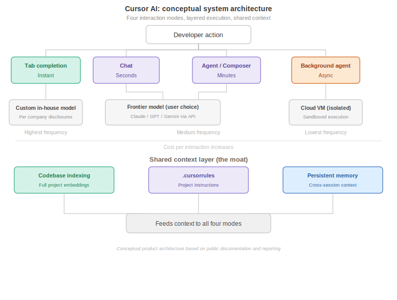
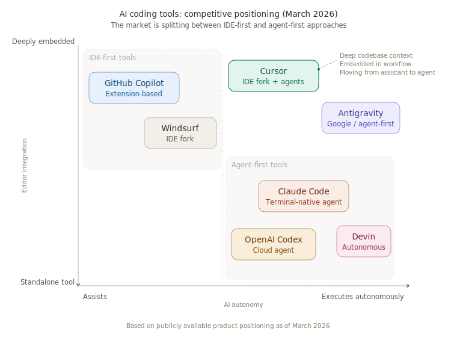

# Cursor AI: Product Teardown

**By: Anushka Marwah**
**Date: March 2026**
**Portfolio: AI Technical Product Manager**

---

> **My thesis:** Cursor's moat is not AI. It is context. The codebase index, the developer's editing patterns, the project rules. Every AI model works better inside Cursor because Cursor feeds it better context. That is the product lesson.

---

## Executive Summary

Cursor is an AI-native code editor built by Anysphere, founded in 2022 by four MIT graduates. It is a fork of Visual Studio Code with AI embedded into every layer of the development workflow.

According to the company's Series D announcement (November 2025), Cursor crossed $1B in annualized revenue and grew to over 300 employees. According to Bloomberg (March 2026), annualized revenue reportedly doubled again to over $2B. The company raised $2.3B at a $29.3B valuation, with backing from Accel, Thrive Capital, Andreessen Horowitz, NVIDIA, and Google.

The growth story is striking, but the product story is more interesting. Anysphere chose to fork VS Code instead of building an extension. That architectural bet gave Cursor full control over the editor and enabled capabilities that extension-based tools like GitHub Copilot cannot replicate: codebase-wide indexing, multi-file atomic edits, and background autonomous agents.

This teardown examines three product decisions behind Cursor's rise, maps the architecture powering its four AI interaction modes, and identifies the strategic risk the company faces as the market shifts from AI-assisted coding to AI-autonomous coding.

---

## Product and Market Context

**The problem:** Developers spend the majority of their time on predictable, repetitive tasks. Boilerplate, imports, renaming, test scaffolds, linting fixes. The high-value work (architecture, debugging, design) gets squeezed.

**Why prior solutions fell short:**

- **GitHub Copilot:** Built as a VS Code extension. The extension API constrains what it can access and modify. It suggests code inline but cannot index the full codebase, apply multi-file changes atomically, or run background agents.
- **ChatGPT / Claude as external tools:** Developers copy and paste between a chat window and their editor. Context is lost. The AI never sees the full project.
- **Traditional IDEs:** Autocomplete is keyword-based, not semantic. Refactoring is manual and rule-based.

**Market context:** The AI coding assistant market was valued at approximately $4.9B in 2024, with projections reaching $30B by 2032. Cursor reported being used by more than half of the Fortune 500 as of its Series C disclosure in June 2025.

---

## Architecture Analysis

Cursor runs four distinct AI systems, each tuned for a different type of developer interaction.

**Tab Completion** is the foundation. As a developer types, Cursor predicts the next action, not just the next line. This runs on Cursor's custom in-house model, not a frontier API. According to the company's Series D blog, their in-house models "generate more code than almost any other LLMs in the world." The model is designed to consume large codebase context and produce small, precise outputs. KV cache optimization and speculative decoding keep it fast enough to feel instant.

My read on why this matters: Tab is the highest-frequency interaction in the product. By running it on an in-house model, Cursor controls latency, cost, and quality independently. If Tab depended on Claude or GPT, every keystroke would carry API cost and third-party latency risk. Most people analyzing Cursor miss this.

**Chat (Cmd+L)** uses frontier models (Claude, GPT, Gemini) chosen by the developer. The @-mention system pulls specific files and functions into context for grounded answers.

**Agent / Composer (Cmd+I)** takes a natural language task description and executes multi-file changes autonomously. It can run up to 8 parallel agents via git worktree isolation.

**Background Agents** run in isolated cloud environments. The developer assigns a task, walks away, and gets a pull request when the agent finishes. According to Cursor's documentation, these can be triggered from Slack, Linear, or issue trackers.

**The architectural insight:** Each mode uses a different model at a different cost and latency tier. The cheapest model handles the most frequent interaction. The most expensive model fires only on complex, infrequent tasks. This layering is how you build a profitable AI product at scale.

| Mode | Model | Speed | Relative Frequency |
|------|-------|-------|--------------------|
| Tab | Custom in-house model (per company disclosures) | Instant | Highest volume |
| Chat | Frontier model, developer's choice | Seconds | Moderate |
| Agent | Frontier + Composer model | Minutes | Lower |
| Background | Frontier on cloud VM | Async | Lowest |

---

## Product Decision Analysis

### Decision 1: Fork VS Code Instead of Building an Extension

GitHub Copilot chose the extension route: zero switching cost, but constrained by the extension API. Cursor forked the entire VS Code codebase to build a standalone editor.

The fork unlocks: full control over the rendering engine and file system, deep codebase indexing, multi-file atomic diffs, background cloud agents, and custom UI (inline diff previews, agent panels).

The fork costs: switching friction (every developer must change editors), engineering overhead (merging upstream VS Code updates), and enterprise IT resistance to non-standard tools.

My analysis: The reported 36 percent free-to-paid conversion rate (cited by SaaStr based on company data, November 2025) suggests the AI capabilities are compelling enough to overcome switching cost. Typical SaaS conversion sits at 5 to 10 percent. This gap is the clearest signal that the fork bet paid off.

**Validation data I would look at:** 30-day churn back to VS Code. Feature usage rates for fork-only capabilities. Time from install to first accepted AI suggestion.

### Decision 2: Proprietary Models for Tab, Frontier APIs for Agent

Cursor built custom models for Tab completion but uses Claude, GPT, and Gemini for Chat and Agent.

The economic reality: Cursor pays retail API prices. Anthropic can offer Claude Code at cost or below cost because they own the model. This creates a structural margin disadvantage for Cursor on every Agent interaction.

Building proprietary models for Tab (the highest-volume interaction) partially solves this. In-house inference is cheaper per request, and Tab accounts for the majority of usage. But Agent mode still runs on frontier APIs, and that is where margin pressure concentrates.

The risk: if frontier model prices continue dropping (they already are), the cost advantage of in-house models shrinks. If Anthropic subsidizes Claude Code aggressively, Cursor's subscription pricing faces direct pressure.

**Data I would watch:** Model cost per request trending over time. Gross margin by interaction type. Ratio of in-house vs API-served interactions.

### Decision 3: Shift from Individual Developers to Enterprise

Cursor grew through pure product-led growth. According to SaaStr's analysis, the company reached $100M ARR with zero marketing spend. Individual developers at $20/month drove the initial scale.

The company has since shifted deliberately toward enterprise. According to Bloomberg, corporate buyers reportedly account for approximately 60 percent of revenue as of early 2026. Enterprise revenue grew 100x during 2025 according to the Series D press release.

My analysis: This is the right strategic move. Enterprise contracts are stickier (procurement cycles and compliance requirements create switching barriers), higher ACV, and less vulnerable to the individual developer price war where Claude Code ($17/month) and Copilot ($10/month) compete aggressively.

The risk is real though. Cursor got here because individual developers loved it and advocated internally. If the enterprise motion creates friction, slows iteration, or shifts focus away from the developer experience, the bottoms-up engine that powers everything could stall.

---

## Competitive Positioning

The AI coding market has split into two camps, and the split reveals a disagreement about the future of development itself.

**Camp 1 (AI inside the IDE):** Cursor, Windsurf, GitHub Copilot. The developer stays in the editor and stays in control. AI accelerates their workflow.

**Camp 2 (AI replaces the IDE):** Claude Code, OpenAI Codex, Devin. The developer describes outcomes. The agent builds autonomously.

**GitHub Copilot** has distribution (reportedly 4.7M paid subscribers per industry reporting, with 90% Fortune 100 adoption) but is architecturally constrained by the extension model. Cheapest at $10/month.

**Claude Code** is the most strategically dangerous competitor. Anthropic owns the model, so they can undercut Cursor on price structurally. Claude Code has reportedly crossed $2.5B in run rate with 300K+ business customers, according to Fortune (March 2026).

**Windsurf** was acquired by Cognition for $250M. Future direction unclear. Roughly 80 percent of Cursor's capability at $15/month.

**The existential question:** If coding shifts from "writing code" to "describing outcomes and trusting the agent," the IDE becomes unnecessary. Claude Code bets on that future. Cursor bets that developers will always want to see, review, and control code. Both have reportedly crossed $2B in revenue. The market has not decided yet.

---

## My Recommendations

### 1. On-Premise Deployment for Regulated Industries

Regulated industries (healthcare, finance, defense, government) cannot send source code to external cloud servers. Cursor's Privacy Mode helps, but highly regulated buyers may still require VPC or air-gapped deployment options that Cursor does not prominently offer today.

This is real revenue being left on the table. But the trade-offs are significant. On-premise deployments bring longer sales cycles, dedicated support and infrastructure teams, deployment complexity that distracts from the core PLG motion, and potential fragmentation between cloud and on-prem product experiences. Organizations like JetBrains and GitLab have shown how on-prem support can become a resource drain.

My judgment: the enterprise revenue mix is reportedly already around 60 percent. Regulated enterprise is the next growth layer, and these buyers will not move until on-prem exists. The trade-offs are real but manageable if scoped carefully, starting with a VPC option before full air-gapped deployment.

### 2. Intelligent Model Routing

Developers manually choose models today. Most do not know when Claude outperforms GPT for their language or codebase.

An automatic routing layer that selects the optimal model per task based on type, language, context length, and latency requirement would solve cost and quality simultaneously. More importantly, it creates a proprietary data flywheel: Cursor learns which models work best for which tasks across millions of developers. Competitors cannot replicate that intelligence without the same usage scale.

### 3. Code Review as a Product

Cursor focuses on writing code. But senior engineers spend 30 to 40 percent of their time reviewing code. A dedicated review agent that understands architectural patterns, security vulnerabilities, and team conventions would open a new buyer persona (engineering managers, security leads) and a higher-value pricing tier.

---

## Key Metrics

**North Star:** AI-accepted lines per developer per day. Measures how much AI-generated code developers actually keep, not how much is suggested.

| Supporting Metric | Why It Matters |
|-------------------|---------------|
| Tab acceptance rate | Core engagement health. If this drops, the most frequent interaction is failing. |
| Agent task completion rate | Quality of autonomous capabilities. Low rate means developers do not trust Agent. |
| Free to Pro conversion | Revenue engine. Currently reported at 36%, far above SaaS norms. |
| Enterprise seat expansion | Land-and-expand health. Shows if teams grow after initial adoption. |
| Model cost per request | Unit economics. Must trend downward for margins to work at scale. |

**Counter-metrics:** Defect density in AI-generated vs human-written code (are speed gains creating bugs?). Token cost growth vs revenue growth (if costs outpace revenue, margins collapse).

---

## PM Takeaway

**"Own the context layer, not the model layer."**

Cursor uses Claude, GPT, and Gemini. Same models available to everyone. What Cursor owns is the context: the codebase index, the project rules, the developer's patterns. That context makes every model work better inside Cursor than outside it.

A Claude call with 500 tokens of context gives a generic answer. The same call with 50,000 tokens of indexed codebase, .cursorrules, and a dependency graph gives a precise, actionable edit. The model is a commodity. The context is the moat.

That is the product lesson. The PM who captures unique context builds a defensible AI product. The PM who wraps an API gets commoditized the moment the model provider ships their own product.

---

## Sources

1. Cursor Series D Announcement, November 2025: [cursor.com/blog/series-d](https://cursor.com/blog/series-d)
2. Bloomberg reporting on $2B ARR, March 2026: [TechCrunch coverage](https://techcrunch.com/2026/03/02/cursor-has-reportedly-surpassed-2b-in-annualized-revenue/)
3. Fortune profile on Cursor's strategic position, March 2026: [fortune.com](https://fortune.com/2026/03/21/cursor-ceo-michael-truell-ai-coding-claude-anthropic-venture-capital/)
4. SaaStr analysis on growth trajectory, November 2025: [saastr.com](https://www.saastr.com/cursor-hit-1b-arr-in-17-months-the-fastest-b2b-to-scale-ever-and-its-not-even-close/)
5. ByteByteGo architecture deep dive: [blog.bytebytego.com](https://blog.bytebytego.com/p/how-cursor-serves-billions-of-ai)
6. Cursor Features and Documentation: [cursor.com/features](https://cursor.com/features)
7. CNBC reporting on Series D and enterprise growth: [cnbc.com](https://www.cnbc.com/2025/11/13/cursor-ai-startup-funding-round-valuation.html)
8. DEV Community comparison (Cursor vs Windsurf vs Claude Code): [dev.to](https://dev.to/pockit_tools/cursor-vs-windsurf-vs-claude-code-in-2026-the-honest-comparison-after-using-all-three-3gof)

---

*This teardown is part of my AI Technical PM Portfolio.*
*Full PDF with expanded analysis and diagrams: [cursor-ai-teardown.pdf](cursor-ai-teardown.pdf)*
*Back to portfolio: [AI PM Portfolio](../../README.md)*
