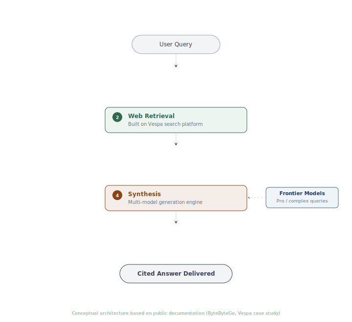
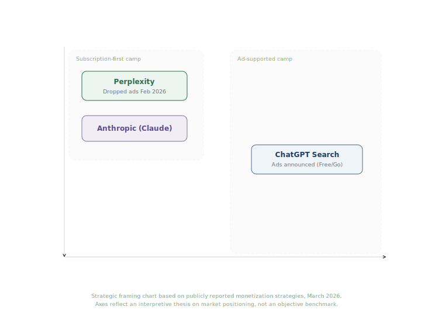

# Perplexity AI: Product Teardown

**By Anushka Marwah**
**March 2026**
**AI Technical Product Manager Portfolio**

---

> **Thesis:** In AI products, trust is the business model. The moment you compromise the answer, you lose the willingness to pay.

---

## Executive Summary

Perplexity is an AI-powered answer engine founded in 2022 by Aravind Srinivas (ex-OpenAI, Google Brain, DeepMind), Denis Yarats, Johnny Ho, and Andy Konwinski. It combines real-time web search with large language models to deliver cited, synthesized answers instead of a list of links.

As of early 2026, Perplexity reached a reported valuation of approximately $20B, with total funding exceeding $1.5B from investors including NVIDIA, Jeff Bezos, SoftBank, and Accel (per TechCrunch, September 2025). ARR reportedly grew from $80M in late 2024 to approximately $200M by early 2026 (per Financial Times and TechCrunch). The platform processes over 780 million queries per month according to mid-2025 reporting.

In February 2026, Perplexity made its most consequential product decision: it abandoned advertising entirely. After testing sponsored answers in 2024, leadership concluded that ads undermined the trust that makes users willing to pay. This put Perplexity in alignment with Anthropic's ad-free stance and in contrast to OpenAI, which announced and began limited testing of ads for U.S. Free and Go users around the same period.

This teardown examines three product decisions that define Perplexity's strategy, maps its RAG architecture, and analyzes the tension between trust-based monetization and the massive scale that advertising enables.

---

## Product and Market Context

**The problem Perplexity solves** is the gap between what people want (an answer) and what search engines provide (a list of links to sort through). Google returns ten blue links. The user clicks three, reads fragments, synthesizes an answer mentally. Perplexity does that synthesis and shows where the information came from.

**Why prior solutions fell short:**

- **Google Search:** Optimized for ad revenue, not answer quality. First results are increasingly ads and SEO-gamed content. Complex knowledge queries require minutes of clicking and reading.
- **ChatGPT (pre-search):** No live web data and no citations. Hallucinations were invisible because there were no sources to check against.
- **Bing/Copilot:** Integrated search but never escaped second-choice positioning. The problem was distribution, not technology.

**Market context:** The global search advertising market exceeds $200B annually, dominated by Google. Perplexity competes for the subset of users who value answer quality over link volume.

---

## Architecture Analysis

Perplexity's core technical capability is not a single model. It is the orchestration of multiple models with a high-performance search retrieval system, designed to deliver fast, accurate, cited answers.

The architecture is a five-stage RAG (Retrieval-Augmented Generation) pipeline:

**Stage 1: Query Intent Parsing.** The system uses a language model to parse intent semantically, not through keyword matching. This step determines which retrieval strategy to use and which models to engage.

**Stage 2: Web Retrieval.** The system searches the live web. Per Vespa's own case study, Perplexity built on Vespa as its search platform rather than building the entire infrastructure stack from scratch. This let a small team focus on RAG orchestration instead of solving distributed search.

**Stage 3: Reranking.** Retrieved documents are reranked using cross-encoder models to surface the most relevant passages. Reranker strength directly determines answer grounding quality.

**Stage 4: Synthesis.** Reranked passages are fed as context to a generation model. Perplexity uses a multi-model system: its in-house Sonar family (built on Meta's Llama architecture) for standard queries, and frontier models from providers like OpenAI and Anthropic for Pro users needing deeper reasoning. An intelligent routing system matches query complexity to the appropriate model.

**Stage 5: Citation Attachment.** Every claim in the output is linked to its source with numbered citations. This is the product's core trust mechanism: users can verify any claim by clicking through to the original source.

**The architectural insight:** Perplexity does not own the best LLM or the best search index. What it owns is the orchestration layer connecting retrieval to generation with citations. That orchestration, combined with the Sonar model family optimized for speed, makes the product feel faster and more trustworthy than alternatives.

| Stage | Function | Key Technology |
|-------|----------|---------------|
| Intent Parsing | Understand what the user wants | LLM-based semantic analysis |
| Web Retrieval | Find relevant documents from live web | Built on Vespa search platform |
| Reranking | Surface the most relevant passages | Cross-encoder models |
| Synthesis | Generate cited answer from passages | Sonar (in-house) + frontier models |
| Citation | Link every claim to its source | Inline numbered references |

---

## Product Decision Analysis

### Decision 1: Abandon Advertising, Go Subscription-First

This is the defining product decision of Perplexity's 2026 strategy.

In November 2024, Perplexity began testing sponsored answers placed beneath AI responses. By October 2025, per Advertising Week reporting, the company had stopped accepting new advertisers and the head of ad sales had departed. In February 2026, leadership confirmed they had abandoned advertising entirely.

The reasoning, per executives quoted in the Financial Times: "A user needs to believe this is the best possible answer, to keep using the product and be willing to pay for it. The challenge with ads is that a user would just start doubting everything."

**My analysis:** The right call for Perplexity's positioning, but a bet with real downside. Google generates over $200B annually from search ads. That revenue funds infrastructure at a scale Perplexity cannot match. Perplexity's reported $200M ARR is 0.1% of Google's search ad revenue. If subscriptions cannot scale fast enough to cover compute costs (which grow with every query), the company faces a margin crisis. The bet works only if the trust premium translates into high conversion rates and low churn.

What makes this relevant for AI PMs: it suggests the Google monetization playbook may not transfer to AI products. In traditional search, users tolerate ads because they understand the format. In an AI answer engine, the answer IS the product. Any perception that the answer is influenced by an advertiser breaks the core value proposition.

**Data I would watch:** Pro subscription conversion rate by cohort. Churn rate among users who experienced ads vs. those who did not. Revenue per query (subscription revenue divided by total queries).

### Decision 2: Build on Vespa Instead of Building Full Search Infrastructure

Perplexity's engineering team was notably small during its early growth phase. Rather than building a web crawler and distributed search system from scratch, the team built on Vespa, an open-source search platform originally developed by Yahoo, as confirmed by Vespa's own published case study.

**My analysis:** A textbook build-vs-buy decision executed at the architectural level. Search indexing is a mature, well-understood problem. Trying to replicate Google's infrastructure would have consumed the entire engineering team. By building on Vespa, Perplexity focused its team on the differentiating parts of the stack: RAG orchestration, Sonar model fine-tuning, and inference speed optimization.

The trade-off is dependency on an external platform for a core capability. If Vespa's performance or roadmap diverges from Perplexity's needs, switching costs would be significant. This is the classic startup tension between speed-to-market and long-term control.

### Decision 3: Citation as a Core Product Feature

From day one, Perplexity showed numbered citations with every answer. Every claim links to its source. Users can verify anything. This was not a feature request or a compliance requirement. It was a founding product decision.

**My analysis:** Citations serve three strategic functions simultaneously. First, they build user trust by making verification instant. Second, they differentiate from ChatGPT, which initially had no citations and still handles them inconsistently. Third, they create a framework for publisher relationships, allowing Perplexity to track when content is cited and share revenue accordingly through its Publisher Program.

The risk: citations also expose weaknesses. When the system misattributes a claim to a source that does not support it, the damage is worse than an uncited error because it looks like verified misinformation. In October 2024, Dow Jones and New York Post filed a lawsuit against Perplexity alleging copyright infringement and, among other claims, alleging that the platform attributed fabricated quotes to their articles. Perplexity published a response asserting the claims were misleading and expressing openness to revenue-sharing arrangements.

---

## Competitive Positioning

The AI search market in 2026 is defined by a fundamental business model split.

*This diagram is a strategic framing chart showing how the market is splitting on monetization and trust. The axes reflect an interpretive thesis, not an objective competitive benchmark.*

**Ad-supported camp:** Google shows ads in AI Overviews (though not yet inside Gemini itself). OpenAI announced and began limited testing of ads in ChatGPT for U.S. users on Free and Go tiers. Both are betting that advertising can coexist with AI answers without destroying trust.

**Subscription-first camp:** Perplexity abandoned ads entirely. Anthropic has publicly criticized AI advertising, running a Super Bowl ad with the tagline "Ads are coming to AI. But not to Claude." Both are betting that users will pay for trustworthy, unbiased answers.

**Google** has distribution nobody can match: billions of daily searches, Chrome, Android, default search deals. But every AI Overview that answers a query directly reduces clicks to ad-supported links. Google's strategic tension is self-cannibalization.

**ChatGPT Search (OpenAI)** has the largest AI user base. Adding web search and citations brings it closer to Perplexity's territory, but citation consistency and source quality remain behind Perplexity's implementation.

**Perplexity** is smaller in user base but reportedly deeper in engagement among paying users. Its positioning as trust-first and citation-first is clear and differentiated. The risk is whether that positioning can scale to hundreds of millions of users on subscriptions alone.

---

## My Recommendations

### 1. Build an Enterprise Research Platform

Perplexity's highest-value users are professionals who run 50+ complex queries per day: analysts, consultants, legal researchers, medical professionals. These users already convert to Pro at higher rates.

I would build a dedicated enterprise product with team workspaces, shared research threads, internal document search alongside web search, audit trails for compliance, and admin controls. This is where ACV jumps from $240/year (individual Pro) to $5,000+/seat/year.

The trade-off: enterprise sales requires a different organizational muscle (sales team, solutions engineers, longer cycles) that could slow the consumer PLG motion.

### 2. Invest in Publisher Relationships as a Strategic Moat

Perplexity's publisher lawsuits are a liability. Its Publisher Program is an emerging asset. If Perplexity becomes the platform publishers trust to share revenue fairly, it creates a content advantage that competitors cannot easily replicate.

I would expand the program aggressively: offer transparency tools for publishers to see how their content performs in Perplexity's answers, and build an economic model where publishers earn more from Perplexity citations than from Google click-throughs.

### 3. Treat Speed as a Strategic Differentiator

Perplexity's Sonar model family is optimized for fast inference. Speed is not just a UX improvement; it is a strategic weapon. If Perplexity can answer complex queries in seconds while alternatives take noticeably longer, that speed gap creates habit formation. Users who experience fast, cited answers do not go back to slow, uncited ones.

I would treat latency as a north star engineering metric with the same priority as answer quality.

---

## Key Metrics

**North Star:** Queries per paying subscriber per day. Measures engagement depth among the users who matter most for revenue.

| Supporting Metric | Why It Matters |
|-------------------|---------------|
| Free-to-Pro conversion rate | Monetization health. The entire business model depends on this. |
| Citation accuracy rate | Trust health. If citations are wrong, the trust moat crumbles. |
| Query volume growth (MoM) | Market adoption. Are more people choosing Perplexity? |
| Publisher revenue share per citation | Publisher relationship health. Keeps content partners engaged. |
| Cost per query | Unit economics. Must decrease as volume scales. |

**Counter-metrics:** Hallucinated citation rate (misattributed sources destroy trust visibly). Pro subscriber churn to ChatGPT Search or Google Gemini (competitive displacement).

---

## PM Takeaway

**"In AI products, trust is the business model."**

For 25 years, search was monetized through ads because users understood the format. They knew which links were paid and which were organic. AI answer engines collapse that separation. The answer IS the product. If users suspect the answer is influenced by advertisers, the value proposition disintegrates.

Perplexity tested this empirically. They tried ads. Users started doubting answers. Leadership saw the trust erosion and pulled the plug. The lesson for AI PMs: do not assume legacy monetization models transfer to AI products. Trust is not a feature you add later. It is the foundation the business model must be built on.

---

## Sources

1. [TechCrunch: Perplexity funding and valuation (September 2025)](https://techcrunch.com/2025/09/10/perplexity-reportedly-raised-200m-at-20b-valuation/)
2. [Financial Times: Perplexity abandons advertising (February 2026)](https://www.macrumors.com/2026/02/18/perplexity-abandons-ai-advertising/)
3. [Campaign US: Perplexity ad reversal analysis](https://www.campaignlive.com/article/perplexity-pulls-plug-ads-citing-trust-concerns-ai/1949142)
4. [ByteByteGo: Perplexity architecture and RAG pipeline](https://blog.bytebytego.com/p/how-perplexity-built-an-ai-google)
5. [Variety: Dow Jones and New York Post lawsuit (October 2024)](https://variety.com/2024/biz/news/news-corp-dow-jones-ny-post-sue-perplexity-copyright-infringement-1236184900/)
6. [TechCrunch: Perplexity query growth, 780M monthly queries (June 2025)](https://techcrunch.com/2025/06/05/perplexity-received-780-million-queries-last-month-ceo-says/)
7. [Perplexity: Sonar API documentation](https://sonar.perplexity.ai/)
8. [CNBC: Perplexity company profile, Disruptor 50 (June 2025)](https://www.cnbc.com/2025/06/10/perplexity-cnbc-disruptor-50.html)

---

*This teardown is part of my AI PM Portfolio.*
*Full PDF with expanded analysis and diagrams: [perplexity-ai-teardown.pdf](perplexity-ai-teardown.pdf)*
*Back to portfolio: [AI PM Portfolio](../../README.md)*
