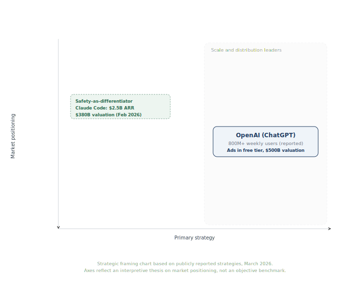

# Claude / Anthropic Platform: Product Teardown

**By Anushka Marwah**
**March 2026**
**AI Technical Product Manager Portfolio**

---

> **Thesis:** In the AI platform market, safety is not a constraint on growth. It is the growth strategy. Anthropic is proving that the company which makes enterprises trust AI captures the most defensible position in the industry.

---

## Executive Summary

Anthropic is an AI safety company founded in 2021 by Dario Amodei, Daniela Amodei, and several former OpenAI researchers. It builds Claude, a family of large language models trained using Constitutional AI, a technique that aligns model behavior with explicit principles rather than relying solely on human feedback.

As of February 2026, Anthropic closed a $30B Series G at a $380B post-money valuation, led by GIC and Coatue (per CNBC and Anthropic's own announcement). Run-rate revenue reached $14B at close, with the company reporting 10x annual revenue growth for three consecutive years. Claude Code, its agentic coding tool launched in May 2025, reached $2.5B in annualized revenue by February 2026. Approximately 80% of revenue comes from enterprise customers, with over 500 customers spending more than $1M annually. Eight of the Fortune 10 are reported Claude customers.

This teardown examines how Anthropic turned safety research into a go-to-market strategy, how its multi-surface product architecture serves different users from the same model family, and whether its positioning can hold against OpenAI's scale and Google's distribution.

---

## Product and Market Context

**The problem Anthropic solves** is the gap between what enterprises need from AI (reliable, auditable, safe) and what the first wave of AI products delivered (impressive but unpredictable). When a hospital, bank, or government agency evaluates AI, the question is not "how smart is it?" but "can we trust it enough to deploy at scale?"

**Why prior solutions fell short:**

- **OpenAI / ChatGPT:** First-mover advantage and massive consumer adoption, but early enterprise trust issues around data handling and model behavior unpredictability created openings. The introduction of ads in ChatGPT's free tier further complicated the trust narrative for enterprise buyers.
- **Google / Gemini:** Unmatched distribution through Search, Cloud, and Android, but AI Overviews launched with high-profile factual errors. Enterprise buyers questioned whether Google would prioritize Gemini or its ad-supported search revenue.
- **Open-source (Meta Llama, Mistral):** Capable and cost-effective for teams with engineering depth, but no managed safety layer, compliance tooling, or enterprise support. Not viable for regulated industries without significant additional investment.

**Market context:** The enterprise AI platform market is growing rapidly, with Anthropic, OpenAI, and Google competing for large-contract deployments. Anthropic's 80% enterprise revenue mix (per its Series G announcement) makes it the most enterprise-dependent of the three major frontier labs.

---

## Platform Architecture

Anthropic serves fundamentally different user types from a single model family through a multi-surface product strategy. This is the core architectural decision that enables both consumer growth and enterprise revenue.

**The model family** ships in three tiers designed to capture different price/capability segments:

- **Haiku:** Fastest, cheapest. Optimized for high-volume, low-latency tasks (classification, extraction, routing). The entry point for cost-sensitive API workloads.
- **Sonnet:** The workhorse. Balances capability with cost. Handles most production workloads including coding, analysis, and content generation. Default for most users.
- **Opus:** Most capable. Designed for complex reasoning, long-context analysis, and agentic workflows. Premium pricing targets use cases where accuracy matters more than cost.

**The surfaces:**

- **claude.ai (Consumer):** Web and mobile interface. Free tier, Pro ($20/month), Max ($200/month). Serves individuals and small teams. Function: top-of-funnel acquisition and brand building.
- **API (Developer/Enterprise):** Token-based pricing across all model tiers. Available on AWS Bedrock, Google Cloud Vertex AI, and Microsoft Azure. Function: primary revenue engine, generating the majority of Anthropic's $14B ARR.
- **Claude Code (Agentic):** Command-line coding agent. Launched May 2025, reached $2.5B ARR by February 2026. Integrated with VS Code and JetBrains. Function: fastest-growing product, driving developer adoption.
- **Cowork (Desktop Agent):** Launched January 2026 for non-developers. Handles spreadsheets, file management, reports, and automated workflows. Function: expanding Claude's addressable market beyond technical users.

**The architectural insight:** Anthropic does not build separate products for separate markets. It builds one model family and routes it through multiple surfaces, each optimized for a different buyer. This creates a flywheel: claude.ai users become familiar with Claude's behavior, developers build on the API, enterprise procurement follows proven developer adoption.

---

## Product Decision Analysis

### Decision 1: Constitutional AI as Go-to-Market Strategy

This is the foundational bet that differentiates Anthropic from every other frontier lab.

Constitutional AI (CAI) trains models using an explicit set of principles (the "constitution") rather than relying solely on human feedback (RLHF). The model evaluates its own outputs against these principles, allowing AI-generated feedback to scale alignment without proportionally scaling human annotation.

**Why this is a product decision, not just a research decision:** CAI produces a model that behaves more predictably and refuses harmful requests more consistently. For enterprise buyers, this translates directly into reduced compliance risk, faster procurement approval, and lower deployment friction.

**My analysis:** Anthropic's bet is that safety converts from a cost center into a revenue driver as regulation increases and enterprise adoption scales. This appears to be working: 80% of revenue comes from enterprises, and the company reports 7x growth in customers spending over $100K annually. The risk is that safety becomes commoditized. If OpenAI and Google adopt equivalent safety techniques, Anthropic's differentiation narrows to execution quality. The counter-argument: safety is an organizational capability requiring safety-first culture, research investment, and willingness to accept capability trade-offs. That is harder to replicate than a technical paper.

**Data I would watch:** Enterprise win rates against OpenAI in regulated industries. Refusal rate on harmless queries (over-refusal erodes trust from the other direction). Time-to-deployment for enterprise pilots vs. competitors.

### Decision 2: Model Tiering (Haiku / Sonnet / Opus)

Anthropic ships three model tiers at different price and capability points, serving the same API with different performance characteristics.

**My analysis:** This is textbook market segmentation applied to AI infrastructure. Instead of forcing all customers onto a single model, tiering captures value across the full demand curve:

Haiku captures high-volume, price-sensitive workloads that would otherwise go to open-source. Sonnet serves the majority of production workloads and generates the bulk of API revenue through volume. Opus captures high-value workloads where customers willingly pay premium pricing for superior reasoning.

The strategic benefit: Anthropic never loses a customer to a cheaper competitor without offering a cheaper option first. And once a developer builds on the API, upgrading from Sonnet to Opus is a configuration change, not a migration.

The risk: maintaining three tiers is expensive. Each requires separate optimization, evaluation, and QA. If the capability gap between tiers narrows as models improve, the pricing justification for Opus weakens.

### Decision 3: Multi-Cloud Distribution (AWS, Google Cloud, Azure)

Claude is the only frontier AI model available on all three major cloud platforms. This is a deliberate strategic choice.

**My analysis:** Multi-cloud solves Anthropic's biggest structural disadvantage: it does not own a cloud platform. OpenAI has Microsoft/Azure. Google has its own cloud.

This creates three advantages. First, it removes a barrier to enterprise adoption: companies committed to Google Cloud or Azure can deploy Claude without changing infrastructure. Second, it reduces dependency on any single cloud partner. Third, it positions Claude as the "Switzerland" of AI models, available everywhere, aligned with no single platform's interests.

The trade-off: multi-cloud requires maintaining integrations across three platforms, each with different deployment patterns, billing, and compliance requirements. And Anthropic's cloud partners are also competitors (Google has Gemini, Microsoft has OpenAI).

---

## Competitive Positioning

The frontier AI market in 2026 is a three-player race with fundamentally different strategies.

*This diagram is a strategic positioning chart. Axes reflect an interpretive thesis on market segmentation, not an objective benchmark.*

**OpenAI** leads in consumer scale with reportedly over 800 million weekly ChatGPT users. Strategy: distribution-first, monetize through subscriptions and advertising. Strengths: brand recognition, consumer adoption, Microsoft partnership. Vulnerability: ads in ChatGPT's free tier create a trust gap enterprise buyers notice.

**Google** has infrastructure advantages nobody can match: Search, Chrome, Android, Cloud, TPUs. Strategy: embed AI into everything Google already owns. Strengths: data, compute, existing enterprise relationships. Vulnerability: self-cannibalization (AI answers reduce clicks to ad-supported results).

**Anthropic** leads in enterprise trust and developer coding workflows. Strategy: safety-as-differentiation. Strengths: Constitutional AI, multi-cloud distribution, Claude Code momentum ($2.5B ARR). Vulnerability: scale. Anthropic is the smallest of the three by user count, and its enterprise-heavy mix means slower top-of-funnel growth.

**The key tension:** Anthropic's safety positioning works best when the market rewards trust. If AI regulation accelerates (likely), Anthropic's head start compounds. If the market remains capability-driven with minimal regulation, OpenAI's scale and Google's distribution dominate.

---

## My Recommendations

### 1. Build a Compliance-Ready Platform for Regulated Industries

Anthropic's strongest position is in industries where deployment requires regulatory approval: healthcare, financial services, legal, government. The company has already launched Claude for Healthcare with HIPAA-ready features.

I would expand this into a full compliance platform: pre-built audit trails, model behavior logs, role-based access controls, and integrations with industry-specific frameworks (SOC 2, HIPAA, FedRAMP). Make Anthropic the default choice when procurement asks "which AI platform can we deploy without regulatory risk?"

The trade-off: vertical compliance work is expensive, slow, and requires domain expertise Anthropic does not currently have at scale.

### 2. Expand Claude Code into a Full Developer Platform

Claude Code is Anthropic's fastest-growing product and most powerful distribution channel. Developers who adopt Claude Code become advocates across their organizations.

I would invest in making Claude Code the hub of a developer ecosystem: native CI/CD integrations, team collaboration features, usage analytics for engineering managers, and an extension marketplace. Make Claude Code as sticky for dev teams as GitHub is for version control.

### 3. Launch an AI Safety Certification Program

If safety is the differentiator, Anthropic should own the definition of "safe AI deployment." I would create an Anthropic-backed certification: training materials, audit frameworks, and a certification badge enterprises can display to customers and regulators.

This positions Anthropic as the standards body for AI safety in practice, not just in research. It creates a moat competitors cannot replicate without adopting Anthropic's framework.

---

## Key Metrics

**North Star:** Enterprise contract expansion rate. Measures whether existing customers are deepening their dependency on Claude across more use cases and higher spend.

| Supporting Metric | Why It Matters |
|-------------------|---------------|
| API token volume growth (MoM) | Usage health. Are developers building more on Claude? |
| Claude Code weekly active users | Product-led growth. Fastest path to enterprise adoption. |
| Enterprise win rate vs. OpenAI | Competitive health. Is the safety positioning converting? |
| Model tier migration (Haiku to Sonnet to Opus) | Upsell health. Are customers moving up the value chain? |
| Refusal accuracy rate | Safety health. Refusing harmful queries without over-refusing benign ones. |

**Counter-metrics:** Claude Code incident rate (production failures undermine the safety brand). Enterprise churn to open-source (pricing pressure signal). Consumer growth rate vs. ChatGPT (lagging adoption limits top-of-funnel).

---

## PM Takeaway

**"Safety is not a constraint. It is the strategy."**

For the first three years of generative AI, the market rewarded speed. Ship fast, iterate publicly, capture users. OpenAI won that phase decisively. But as AI moves from experimentation to enterprise infrastructure, buying criteria shift. Enterprises do not optimize for "most impressive demo." They optimize for "least likely to create a compliance incident."

Anthropic bet on this shift before it happened. Constitutional AI was not built to slow Claude down. It was built to make Claude the model enterprises trust enough to deploy at scale. The result: 80% enterprise revenue, $14B ARR, and a $380B valuation built on the thesis that safety converts into revenue.

The lesson for AI PMs: in platform markets, trust compounds. The company that establishes itself as the safe, reliable default captures switching costs that pure capability cannot. Features can be copied. Trust must be earned.

---

## Sources

1. [CNBC: Anthropic closes $30B round at $380B valuation (February 2026)](https://www.cnbc.com/2026/02/12/anthropic-closes-30-billion-funding-round-at-380-billion-valuation.html)
2. [Anthropic: Series G announcement, $14B ARR, Claude Code $2.5B (February 2026)](https://www.anthropic.com/news/anthropic-raises-30-billion-series-g-funding-380-billion-post-money-valuation)
3. [Anthropic: Constitutional AI research paper](https://www.anthropic.com/research/constitutional-ai-harmlessness-from-ai-feedback)
4. [Anthropic: Next-generation Constitutional Classifiers (2025)](https://www.anthropic.com/research/next-generation-constitutional-classifiers)
5. [TechCrunch: Anthropic launches Cowork for non-developers (January 2026)](https://techcrunch.com/2026/01/12/anthropics-new-cowork-tool-offers-claude-code-without-the-code/)
6. [Microsoft Azure Blog: Claude models in Microsoft Foundry (November 2025)](https://azure.microsoft.com/en-us/blog/introducing-anthropics-claude-models-in-microsoft-foundry-bringing-frontier-intelligence-to-azure/)
7. [Anthropic: Microsoft, NVIDIA, and Anthropic strategic partnerships (November 2025)](https://www.anthropic.com/news/microsoft-nvidia-anthropic-announce-strategic-partnerships)
8. [Crunchbase: Anthropic Series G, second-largest VC deal ever (February 2026)](https://news.crunchbase.com/ai/anthropic-raises-30b-second-largest-deal-all-time/)

---

*This teardown is part of my AI PM Portfolio.*
*Full PDF with expanded analysis and diagrams: [claude-anthropic-teardown.pdf](claude-anthropic-teardown.pdf)*
*Back to portfolio: [AI PM Portfolio](../../README.md)*
