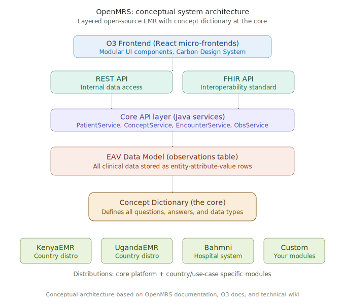
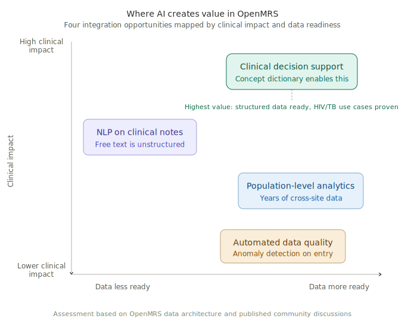

# OpenMRS: Product Teardown

**By: Anushka Marwah**
**Date: March 2026**
**Portfolio: AI Technical Product Manager**

---

> **My thesis:** The PM who understands the legacy system will build the better AI product. Most AI-in-healthcare startups treat the EMR as a black box. OpenMRS teaches you what is inside the box.

---

## Executive Summary

OpenMRS is an open-source electronic medical record system designed for healthcare settings in low and middle-income countries. It emerged in 2004 out of global health and informatics collaboration, with roots in work from the Regenstrief Institute and long-standing partnership from organizations like Partners in Health.

According to OpenMRS.org, the platform has an estimated development value of $70 million and received over 2,200 code contributions in 2025. It is deployed across healthcare facilities in over 40 countries (per the OpenMRS product page), with country-specific distributions including KenyaEMR, UgandaEMR, and eSaude (Mozambique). It is backed by a broad coalition of global health organizations and implementation partners.

I chose OpenMRS as my fourth teardown because it fills a gap that no other product in this portfolio covers. While Cursor, Perplexity, and Claude represent the AI-native layer, OpenMRS represents the healthcare infrastructure layer that any AI product must integrate with. If you want to build AI for healthcare, you need to understand how clinical data is stored, structured, and accessed. OpenMRS is, in my judgment, one of the most transparent systems to learn that from, because the entire codebase, data model, and concept dictionary are open.

This teardown analyzes three architectural decisions that define OpenMRS, maps how its data model works, and identifies where AI creates the most value in legacy EMR systems.

---

## Problem and Why OpenMRS Exists

The problem OpenMRS was built to solve is not a technology problem. It is a resource problem. In the early 2000s, the HIV/AIDS pandemic was devastating developing countries. Healthcare facilities in these regions often had no digital record systems. Patient histories were on paper. Treatment adherence was untracked. Research was nearly impossible because there was no structured data to analyze.

Existing EMR systems were designed for well-funded hospitals in high-income countries. Epic and Cerner cost millions to deploy, require dedicated IT teams, and depend on reliable electricity and internet. None of those assumptions hold in rural Kenya, Haiti, or Mozambique.

OpenMRS was created to fill that gap: a free, open-source, modular EMR that can run on minimal infrastructure and supports the full range of clinical workflows from HIV treatment to maternal care to general outpatient services.

**Why this matters for an AI PM:** Every AI-in-healthcare startup eventually has to answer the question "how does this connect to the patient record?" In high-income countries, the answer is Epic or Cerner (proprietary, expensive to integrate with). In the 40+ countries running OpenMRS, the answer is an open-source system with a public data model, public APIs, and a concept dictionary you can read line by line. If you understand OpenMRS, you understand how clinical data works at a structural level. That knowledge transfers directly to building AI products that integrate with any EMR.

**Who uses OpenMRS:**

| User Type | What They Need |
|-----------|---------------|
| Ministries of Health | National EMR standards and unified reporting |
| NGOs and aid organizations | Affordable, deployable care tools for low-resource settings |
| Hospitals and clinics in LMICs | Patient record management without vendor lock-in |
| Global health researchers | Structured, cross-site clinical data for analysis |
| Developers | An open platform to build healthcare applications on |

---

## Architecture Analysis

OpenMRS has three architectural components that any AI PM working in healthcare should understand deeply.

### 1. The Concept Dictionary

This is the most important architectural idea in OpenMRS. At the heart of the system is a dictionary that defines every data point that can be stored: clinical findings, lab results, diagnoses, medications, socio-economic data. Both the questions ("What is the patient's blood pressure?") and the answers ("120/80 mmHg") are encoded as concepts.

This approach, rooted in the Regenstrief Institute's decades of medical record system development, means the database schema never needs to change when a new disease appears or a new data point needs to be tracked. You add a concept to the dictionary.

My read on why this matters for AI: The concept dictionary makes cross-site analytics and machine learning substantially more feasible by improving semantic consistency across implementations. Without standardized encoding, the same clinical finding gets entered in thousands of different ways by different clinicians. The dictionary forces a shared vocabulary. It also enables cross-country research: if two hospitals use the same concept dictionary, their data can be compared directly.

### 2. The Modular Architecture

OpenMRS is built as a core platform with pluggable modules (called OMODs on the backend and ESMs on the frontend). The core handles patient records, encounters, and observations. Everything else (appointment scheduling, lab integration, pharmacy management, reporting) is a module that can be added or removed.

Country-specific distributions (KenyaEMR, UgandaEMR) are essentially the core platform plus modules tailored to that country's clinical workflows and reporting requirements.

OpenMRS 3 (O3), the latest version, takes modularity further. According to the O3 documentation, the frontend is built with React and uses a micro-frontend architecture where each UI component is a separately deployable module. The backend communicates via REST and FHIR APIs. O3 runs on top of existing databases without requiring a backend overhaul.

### 3. The Entity-Attribute-Value (EAV) Data Model

OpenMRS stores clinical data using an EAV model rather than a traditional relational schema. Instead of having a table for blood pressure, a table for diagnoses, and a table for medications, all clinical observations are stored as rows in an observations table, each linked to a concept from the dictionary.

This means: adding a new data type requires zero schema changes. It also means: querying the data requires understanding the concept relationships, not just table names. For AI engineers accustomed to clean relational databases, this is a significant paradigm shift that directly affects how you build training pipelines and feature engineering on clinical data.

| Component | What It Does | AI Relevance |
|-----------|-------------|-------------|
| Concept Dictionary | Defines all possible clinical data points | Semantic consistency for ML training |
| Modular Architecture | Pluggable features without changing core | AI modules can be added without disrupting care |
| EAV Data Model | Flexible clinical data storage | Requires specialized ETL for model training |
| FHIR APIs (O3) | Standardized data access | AI apps integrate via open standard |

---

## Product Decision Analysis

### Decision 1: Open Source Instead of Proprietary

OpenMRS is entirely open source, with no licensing fees. Every line of code is public. The concept dictionary is shared across implementations. This was a founding philosophical choice aligned with the global health mission.

**What this enables:** Any hospital, any country, any organization can deploy OpenMRS without procurement cycles or vendor contracts. Developers worldwide contribute improvements. Country-specific distributions can be built without forking the core codebase.

**What this costs:** No commercial revenue model means OpenMRS depends on grants, donations, and volunteer labor. There is no dedicated sales team. Support comes from the community and implementation partners rather than a vendor SLA. Feature development pace is constrained by funding cycles rather than market demand.

My analysis: For the global health context OpenMRS serves, open source was the only viable path. A six-figure annual license fee would make deployment impossible in most of the 40+ countries using OpenMRS. The trade-off is that OpenMRS evolves more slowly than commercially funded EMRs and depends on sustained donor commitment.

### Decision 2: Concept Dictionary over Fixed Schema

Rather than building a database with fixed tables for each clinical data type, OpenMRS uses a concept dictionary that defines all possible data points. This is a deliberate architectural choice that trades query simplicity for extensibility.

**What this enables:** New diseases, new lab tests, new clinical protocols can be added by updating the dictionary, not the database schema. This was essential for HIV treatment, where guidelines changed frequently and new data points (viral load, CD4 count, ARV regimens) needed to be tracked rapidly. It also enables cross-site and cross-country research because the dictionary provides a shared vocabulary.

**What this costs:** The EAV model makes standard SQL queries more complex. Reporting and analytics require understanding concept relationships. Performance can degrade on large datasets without careful indexing. Developers from traditional relational database backgrounds face a learning curve.

My analysis: This was a prescient decision. The concept dictionary is what makes OpenMRS data substantially more usable for research and analytics than unstructured clinical records. The trade-off in query complexity is real but manageable with proper tooling and ETL pipelines (the community has built an OpenMRS-to-OMOP ETL tool, for example).

### Decision 3: FHIR Compliance in O3

OpenMRS 3 introduced a FHIR module that serves as a translation layer between the internal OpenMRS data model and the FHIR standard. According to OpenMRS documentation, the platform is described as "FHIR-friendly and FHIR-compliant," meaning external systems can access OpenMRS data through standardized FHIR APIs.

**What this enables:** Any application that speaks FHIR can integrate with OpenMRS. This is the same standard that Epic and Cerner support, which means (in principle, though real-world integration always involves additional work) an AI tool built for OpenMRS FHIR endpoints could be adapted for commercial EMR environments as well. It also positions OpenMRS for interoperability with national health information exchanges.

**What this costs:** FHIR is a complex standard. The translation layer between OpenMRS's internal EAV model and FHIR adds overhead and potential mapping edge cases. Not all OpenMRS data maps cleanly to FHIR resources.

My analysis: FHIR compliance is the decision that makes OpenMRS relevant beyond low-resource settings. It transforms the platform from "the EMR for developing countries" into "an open-source, FHIR-compliant EMR that can participate in broader health data ecosystems." For AI PMs, this is the integration layer that determines whether your product can cross from one EMR environment to another.

---

## Where AI Creates the Most Value in OpenMRS

Instead of a traditional competitive positioning section (OpenMRS is not competing with Epic for market share), this section analyzes where AI integration would create the most clinical and operational value. These are grounded in the constraints of low-resource health systems, not generic AI optimism.

### 1. Clinical Decision Support

OpenMRS stores years of patient encounter data across facilities. An AI model trained on this structured data could surface treatment recommendations based on patterns in similar past cases. For HIV treatment specifically, this means predicting which patients are at risk of defaulting on antiretroviral therapy and flagging them for intervention before they disengage from care. The concept dictionary makes this feasible because treatment data is semantically consistent across sites.

### 2. NLP on Unstructured Clinical Notes

While the concept dictionary enforces structure on coded data, clinicians also write free-text notes in encounter records. These notes contain clinical insights invisible to the structured data layer. An NLP pipeline that extracts diagnoses, symptoms, and treatment responses from free text and maps them to concepts in the dictionary would increase the data available for both care coordination and research.

### 3. Predictive Analytics on Population Data

OpenMRS implementations have accumulated years of population-level data on HIV, TB, maternal health, and more. In principle, predictive models could support forecasting of disease trends at the facility or district level, identification of at-risk populations, and optimization of resource allocation across facilities. Realizing these outcomes in practice would require significant data cleaning, validation, and contextual adaptation for each deployment.

### 4. Automated Data Quality

Data quality is a persistent challenge in OpenMRS deployments. Missing fields, inconsistent coding, and data entry errors are common, especially in facilities with high patient volumes and limited staff. An AI layer that detects anomalies, suggests corrections, and scores data quality in real time would improve both clinical care and research reliability. This connects directly to my ClarityFHIR case study elsewhere in this portfolio.

---

## Key Metrics

OpenMRS is not measured by commercial metrics like ARR or conversion rate. It is measured by mission impact and ecosystem health.

**North Star:** Patient records with complete, structured data. Measures the system's ability to capture comprehensive clinical information, which is the foundation for both care quality and AI readiness.

| Supporting Metric | Why It Matters |
|-------------------|---------------|
| Concept dictionary coverage | What percentage of clinical observations are coded vs free text. Higher coverage means more ML-ready data. |
| Data completeness rate per facility | Missing data limits both care quality and research. |
| FHIR API adoption rate | How many implementations use FHIR endpoints. Indicates interoperability readiness. |
| Module ecosystem growth | New modules contributed per year. Reflects community health. |
| Time to deploy a new implementation | Speed of adoption. Lower time means better tooling and documentation. |

---

## PM Takeaway

**"The PM who understands the legacy system builds the better AI product."**

Most AI-in-healthcare startups treat the EMR as a black box. They build a model, then struggle to integrate it because they do not understand how clinical data is structured, stored, and accessed. OpenMRS is the antidote to that blind spot. Its open codebase, public data model, and concept dictionary are a hands-on education in healthcare data architecture.

The PM who studies OpenMRS understands: why clinical data is messy (because medicine is messy), how concept dictionaries enforce semantic consistency (and where they break down), why FHIR matters for interoperability, and what the real constraints are in low-resource healthcare settings (limited bandwidth, non-technical users, regulatory variation across countries).

That understanding is the difference between an AI product that works in a demo and one that works in a hospital.

---

## Sources

1. [OpenMRS: Product page (features, deployment, estimated value)](https://openmrs.org/product/)
2. [Regenstrief Institute: OpenMRS founding history (PMC)](https://pmc.ncbi.nlm.nih.gov/articles/PMC1839362/)
3. [OpenMRS: O3 architecture documentation](https://o3-docs.openmrs.org/docs/core-concepts)
4. [OpenMRS: Technical overview (data model, API, modules)](https://openmrs.atlassian.net/wiki/spaces/docs/pages/25476856/Technical+Overview)
5. [OpenMRS: O3 explained and the investments that made it possible](https://openmrs.org/o3-the-new-openmrs-explained-and-the-investments-that-made-it-possible/)
6. [OpenMRS Talk: AI integrations and OpenMRS (community discussion)](https://talk.openmrs.org/t/ai-integrations-and-openmrs/47339)
7. [OpenMRS: Community homepage](https://openmrs.org/)
8. [OpenMRS: Concept dictionary documentation](https://openmrs.atlassian.net/wiki/spaces/docs/pages/25469882/Concept+Dictionary+Basics)

---

*This teardown is part of my AI PM Portfolio.*
*Full PDF with expanded analysis: [openmrs-teardown.pdf](openmrs-teardown.pdf)*
*Back to portfolio: [AI PM Portfolio](../../README.md)*
