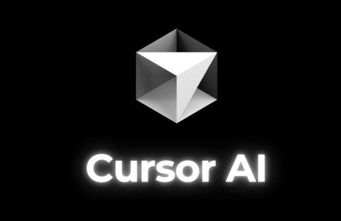

<p align="center">
  <a href="#the-teardowns">
    
  </a>
</p>

<p align="center">
  <a href="#the-teardowns"></a>
  &nbsp;
  <a href="#skills-demonstrated"></a>
</p>

<br/>

## About This Repository

This repository contains product teardowns written from the perspective of an AI Technical Product Manager. Each one goes beyond surface-level feature comparison to analyze **architecture, product decisions, competitive dynamics, and unit economics** — the things that actually determine whether an AI product wins or dies.

Every teardown follows a consistent structure: executive summary → architecture analysis → product decision deep-dives → competitive positioning → recommendations → key metrics. Each teardown is grounded in public information, structured analysis, and explicit trade-offs.

<br/>

---

<br/>

## The Teardowns

<table>
<tr>
<td width="50%" valign="top">

<br/>

<p align="center">
  
</p>

<h3 align="center">Cursor AI</h3>

<p align="center"><em>The AI-native code editor that bet the company on a VS Code fork.</em></p>

Cursor crossed $2B+ ARR by forking VS Code instead of building an extension. This teardown examines the architectural bet that unlocked codebase-wide indexing and multi-file agents, the cost logic behind proprietary models for completions vs. frontier APIs for complex tasks, and the existential question: what happens to the IDE if coding becomes prompt-driven?

<p align="center">
<kbd>Architecture</kbd>&nbsp;<kbd>Build vs. Buy</kbd>&nbsp;<kbd>Model Cost Layering</kbd>&nbsp;<kbd>Enterprise GTM</kbd>
</p>

<p align="center">
<a href="https://drive.google.com/file/d/1j51giyhsyUaT1bBklknECJxTUmBzHPHl/view"></a>
&nbsp;&nbsp;
<a href="./01-cursor-ai"></a>
</p>

<br/>

</td>
<td width="50%" valign="top">

<br/>

<p align="center">
  
</p>

<h3 align="center">Perplexity AI</h3>

<p align="center"><em>The answer engine that tried ads, then killed them.</em></p>

Perplexity abandoned advertising in Feb 2026 after concluding that sponsored answers undermined the trust their product depends on. This teardown maps the five-stage RAG pipeline powering cited answers, analyzes the subscription-only bet against Google's $200B ad machine, and asks whether trust-first monetization can survive at scale.

<p align="center">
<kbd>RAG Pipeline</kbd>&nbsp;<kbd>Monetization Strategy</kbd>&nbsp;<kbd>Citation as Product</kbd>&nbsp;<kbd>Trust Economics</kbd>
</p>

<p align="center">
<a href="https://drive.google.com/file/d/1Qt7QQc_oPiBIQdH4flWX7SiV2P5ObnLX/view"></a>
&nbsp;&nbsp;
<a href="./02-perplexity-ai"></a>
</p>

<br/>

</td>
</tr>
<tr>
<td width="50%" valign="top">

<br/>

<p align="center">
  
</p>

<h3 align="center">Claude / Anthropic</h3>

<p align="center"><em>The company that turned AI safety into a $14B revenue engine.</em></p>

Anthropic reached $14B run-rate revenue with 80% from enterprises and 500+ customers at $1M+. This teardown analyzes how Constitutional AI became a go-to-market strategy, the multi-surface architecture spanning claude.ai, API, Claude Code, and Cowork, and the three-cloud distribution play no other frontier model has replicated.

<p align="center">
<kbd>Constitutional AI as GTM</kbd>&nbsp;<kbd>Model Tiering</kbd>&nbsp;<kbd>Multi-Cloud</kbd>&nbsp;<kbd>Platform Architecture</kbd>
</p>

<p align="center">
<a href="https://drive.google.com/file/d/1GCsQcl7u9bj-AJp3srHbHqJsHjZNIYnp/view"></a>
&nbsp;&nbsp;
<a href="./03-claude-anthropic"></a>
</p>

<br/>

</td>
<td width="50%" valign="top">

<br/>

<p align="center">
  
</p>

<h3 align="center">OpenMRS</h3>

<p align="center"><em>The open-source EMR that teaches you what's inside the healthcare black box.</em></p>

While the other teardowns cover AI-native products, this one covers the healthcare infrastructure layer any AI product must integrate with. OpenMRS runs in 40+ countries, and its concept dictionary, EAV data model, and FHIR APIs define how clinical data is actually structured — and where AI creates real value vs. where the data isn't ready.

<p align="center">
<kbd>Healthcare Data Architecture</kbd>&nbsp;<kbd>FHIR</kbd>&nbsp;<kbd>AI in Global Health</kbd>&nbsp;<kbd>Open Source Strategy</kbd>
</p>

<p align="center">
<a href="https://drive.google.com/file/d/1ozLmUzBWiWXoBJjy_JOKepiF8Gau3ZSt/view"></a>
&nbsp;&nbsp;
<a href="./04-openmrs"></a>
</p>

<br/>

</td>
</tr>
</table>

<br/>

---

<br/>

## Skills Demonstrated

<table>
<thead>
<tr>
<th align="left" width="240">Domain</th>
<th align="left">What These Teardowns Show</th>
</tr>
</thead>
<tbody>
<tr>
<td><a href="#the-teardowns"></a></td>
<td>Market positioning, build-vs-buy decisions, monetization trade-offs, competitive response planning</td>
</tr>
<tr>
<td><a href="#the-teardowns"></a></td>
<td>System design analysis, model routing, RAG pipelines, API design patterns, EAV data modeling</td>
</tr>
<tr>
<td><a href="#the-teardowns"></a></td>
<td>Unit economics, margin structure, revenue mix analysis, enterprise vs. consumer growth dynamics</td>
</tr>
<tr>
<td><a href="#the-teardowns"></a></td>
<td>Model cost layering, inference optimization, proprietary vs. frontier API trade-offs, safety-as-GTM</td>
</tr>
<tr>
<td><a href="#the-teardowns"></a></td>
<td>EMR architecture, FHIR interoperability, clinical data models, regulated-industry product constraints</td>
</tr>
<tr>
<td><a href="#the-teardowns"></a></td>
<td>Clear reasoning, trade-offs, and structured analysis throughout</td>
</tr>
</tbody>
</table>

<br/>

---

<br/>

## Repo Structure

```
ai-pm-teardowns/
│
├── assets/                          # Logos and banner
│
├── 01-cursor-ai/
│   ├── README.md
│   ├── cursor-ai-teardown.pdf
│   ├── architecture-diagram.svg
│   └── competitive-landscape.svg
│
├── 02-perplexity-ai/
│   ├── README.md
│   ├── perplexity-ai-teardown.pdf
│   ├── architecture-diagram.svg
│   └── competitive-landscape.svg
│
├── 03-claude-anthropic/
│   ├── README.md
│   ├── claude-anthropic-teardown.pdf
│   ├── architecture-diagram.svg
│   └── competitive-landscape.svg
│
├── 04-openmrs/
│   ├── README.md
│   ├── openmrs-teardown.pdf
│   ├── architecture-diagram.svg
│   └── competitive-landscape.svg
│
└── README.md
```

Each folder contains the full teardown PDF, architecture diagram, competitive landscape map, and a folder-level README. They stand alone — start with whichever product interests you.

<br/>

---

<br/>

## Methodology

These are not summaries of press coverage. Each teardown is built from primary sources: company announcements, published architecture documentation, engineering deep-dives, and direct product experience. Where figures are estimated or reported, they are labeled as such. Where a judgment call is made, it is stated explicitly.

<br/>

---

<p align="center">
  <br/>
  
  <br/><br/>
  <sub>All analysis reflects publicly available information as of March 2026</sub>
  <br/><br/>
</p>
